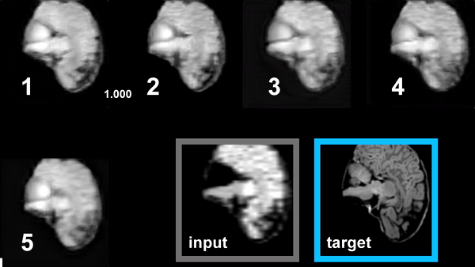
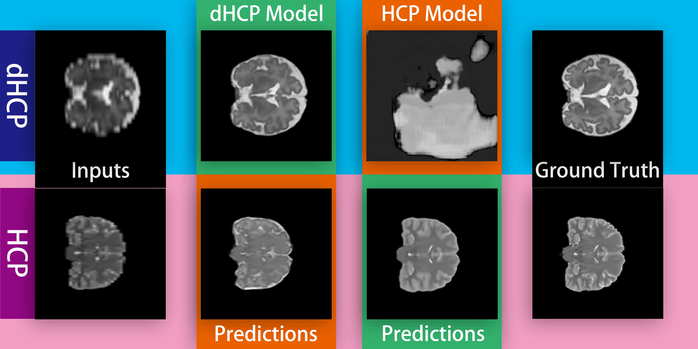

# Adaptive 3D U-Nets for Low-Field MRI using Bayesian Model Selection

<p align="center">
  
</p>
<p align="center">
  Image quality improves with increasing epochs.
</p>

<p align="center">
  
</p>
<p align="center">
  Model architecture.
</p>

This repositry contains the code for the paper Enhanced Reliability and Robustness of Super-resolution U-NETS for Low-Field MRI using Bayesian Model Selection.

## Directory structure

The directory structure is as follows:

    .
    ├── CODE_OF_CONDUCT.md
    ├── configs # Configuration files for training
    ├── dataloaders # Data loaders
    ├── datasets  # Dataset classes and preprocessing scripts
    ├── inference # Inference scripts
    ├── LICENSE
    ├── models  # Model classes
    ├── pretrained_models # Pretrained models used in the paper and archived model checkpoints
    ├── README.md
    ├── requirements.txt
    ├── resource  # Images used in the README
    ├── results # Results of inference
    ├── train_cai.py  # Training script in high performance cluster environments
    ├── train_prof.py # Training script with profiling
    ├── train.sh  # example shell script for training
    ├── train_vae_nocai.py # Training script for single node training
    └── utils # Utility functions and submisson scripts for high performance cluster environments

## Example Configuration

configurations for training are stored in the configs directory. The following is an example configuration file for training on the BraTS dataset:
  
  ```python
  from colossalai.amp import AMP_TYPE
  import os

  DATA_DIR = "/path/to/inputs/preprocessed_h5"
  OUTPUT_DIR = "/path/to/outputs"
  AUGMENTATION=False  # data augmentation
  INPUT_MODALITIES=["t2"] # input modalities. Set to ["t1", "t2"] for T1 and T2
  OUTPUT_MODALITIES=["t2"]  # output modalities. Set to ["t1", "t2"] for T1 and T2
  BATCH_SIZE=6  # batch size
  IN_CHANNELS=1 # number of input channels. Set to 2 for T1 and T2
  OUT_CHANNELS=1 # number of output channels. Set to 2 for T1 and T2
  NUM_EPOCHS=4000   # number of epochs
  N_SPLITS=5 # number of folds for cross validation
  F_MAPS=[16, 32, 64, 128, 256] # feature map sizes
  OPTIMIZER='adam' # optimizer, adam or lamb


  LR=0.001 # learning rate
  NUM_SAMPLES=None  # Dataset size. Set to None for full dataset
  DATASET='BraTS' # dHCP, HCP, BraTS are supported
  ```

## Quick start

Install dependencies
```bash
pip install -r requirements.txt
```

Prepare the dataset. The unprocessed data can be downloaded from the following links:
* [dHCP](https://biomedia.github.io/dHCP-release-notes/download.html)
* [HCP](https://www.humanconnectome.org/study/hcp-young-adult/document/1200-subjects-data-release)
* [BraTS](https://www.synapse.org/#!Synapse:syn27046444/wiki/616992)

The preprocessing scripts are located in the datasets directory. To preprocess the data, change the paths in the preprocessing scripts and run the scripts. 

```python
# datasets/preproc_dhcp.py
...
data_dir = '/media/hdd/dhcp/dhcp_hires' # path to the unprocessed data
...
```

The preprocessing scripts will create a directory called preprocessed_h5 in the dataset directory. The preprocessed data will be stored in the preprocessed_h5 directory.

```bash
cd datasets
python preproc_dhcp.py
python preproc_hcp.py
python preproc_brats.py
```

To train the model, change the paths in the configuration file and run the training script.

```python
# configs/CREATE/unet/config_unet_brats_t2_5000.py
...
DATA_DIR = "/path/to/inputs/preprocessed_h5" # path to the preprocessed data
OUTPUT_DIR = "/path/to/outputs" # path to the output directory
...
```

```bash
python train.py --config configs/CREATE/unet/config_unet_brats_t2_5000.py
```

## Example inference
<p align="center">
  
</p>


